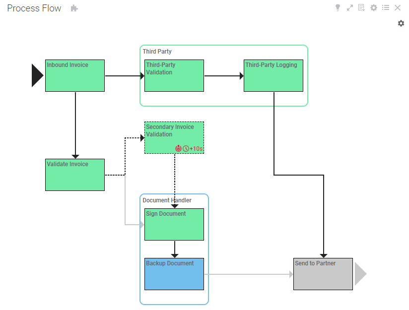
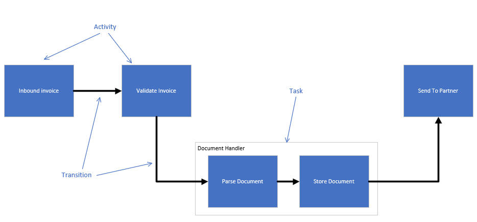
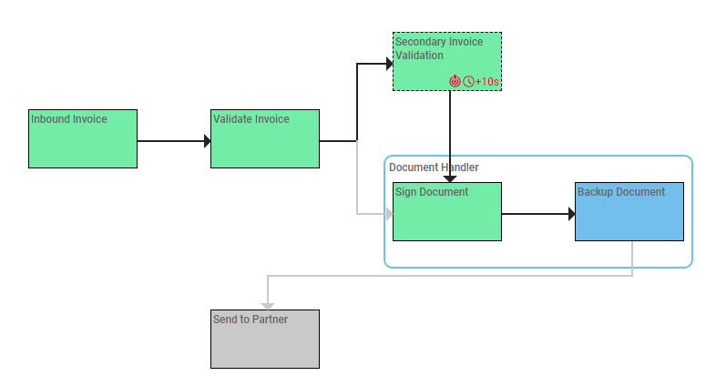
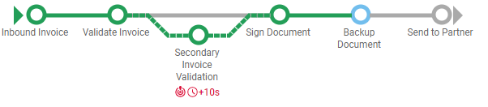
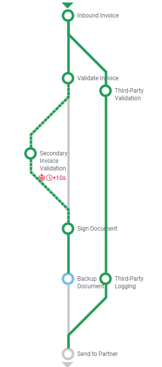
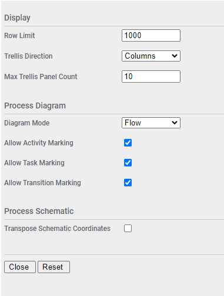

# Process Diagram Mod for Spotfire®

The Process Diagram Mod is a graphical representation of process steps and their dependencies. It has application in business activity monitoring and process tracking use cases. The mod provides two different methods for displaying a process, either as a process flow, or a process schematic. In the case of a process schematic it can be oriented either horizontally or vertically.

## Try this mod in Spotfire® Analyst

### How to open the mod
1. Open Spotfire® Analyst, and create an analysis by loading some data.
2. Unzip the downloaded file, and locate the .mod file in the unzipped folder. 
3. Drag the file into the analysis. 
4. The visualization mod is added to the analysis.
5. To learn about the capabilities and limitations of this visualization mod, keep reading.

For general information on how to use and share visualization mods, [read the Spotfire documentation](https://docs.tibco.com/pub/sfire-analyst/14.1.0/doc/html/en-US/TIB_sfire-analyst_UsersGuide/index.htm#t=modvis%2Fmodvis_how_to_use_a_visualization_mod.htm).

## Data requirements

Every mod handles missing, corrupted and/or inconsistent data in different ways. It is advised to always review how the data is visualized.

The Process Diagram Mod will render a graphical representation of all the activities, tasks, and transitions within a process. These terms are defined as:

* **Process** - a set of actions within a defined business process

* **Activity** - a unit of work in a process that would be tracked as part of a BAM system

* **Task** - a logical grouping of two or more activities for business level monitoring

* **Transition** - a dependency between two activities within a process

Here is a graphical representation of what this looks like:

This mod can handle processes with parallel paths of execution and optional steps.

To display the diagram, all activity, task, and transition data must exist in a single table, and each object must exist in a single row. At a minimum there must be two activity rows and a single transition row.

The process flow layout handles all of these objects, but the process schematic does not render tasks.

## Setting up the Process Diagram

The minimum data required is presented in this sample data set: 

| objectType | activityId  | taskId | positionX | positionY | displayName | initialActivityId | terminalActivityId |
| ---------- | ----------- | ------ | --------- | --------- | ----------- | ----------------- | ------------------ |
| Activity | act1Id | | 0 | 0 | My First Activity | | |
| Activity | act2Id  | myTaskId | 20 | 20 | My Second Activity | | |
| Activity | act3Id  | myTaskId | 50 | 20 | My Third Activity | | |
| Transition | | | | | | act1Id | act2Id |
| Transition | | | | | | act2Id | act3Id |
| Task | | myTaskId | | | My Task | |

Here there are the minimum required 3 rows, two activity rows and 1 transition row. An additional activity and transition are included, as well as a task. The row type is identified by the **objectType** column. The values in this column _must_ be **Activity**, **Transition**, or **Task**. Any other values will cause the row to be ignored. 

The unique identifier for the activities is **activityId** and this must be unique within the scope of data passed into a mod instance. This is ignored for transition and task rows.

The unique identifier for the task is **taskId** and this must be unique within the scope of data passed into a mod instance. To indicate which activites are part of a task, the taskId must be populated on activity rows as well. This is ignored for transition rows. Tasks are optional, and will not be displayed on process schematic layouts.

The **positionX** and **positionY** columns are required for positioning each activity within the diagram. It may require some experimentation to determine the optimal layout for the process diagram. Task and transition positions are automatically computed based on the positions of the related activities, so these values are ignored for transition and task rows.

The **displayName** column applies to the displayed name for each activity and task row. This is ignored for transition rows.

The **initialActivityId** and **terminalActivityId** apply to transition rows, and indicate the initial and terminal activities for the transition and must refer to values in activityId for provided activity rows. These are ignored for activity and task rows.

Additional optional fields are supported when configuring the mod properties.

Specify the data table with marking and filters as usual. The diagram supports marking data; you can set the **Marking** property as desired.

The mod includes the follow axes. Not all axis values are mandatory and will be indicated.

### Object Type
Mandatory. Must contain "Activity", "Task", or "Transition" identifying each row as the respective object. Any other values will cause the row to be ignored.

### Display Name
Mandatory for activities and tasks, ignored for transitions. This will be the name rendered.

### Trellis By
Optional. If set then data will be grouped and trellised.

### Activity ID
Mandatory for activities, ignored for tasks and transitions. This is the unique identifier for activites.

### Delay
Optional for activities and tasks, ignored for transitions. This should evaluate to a string that indicates the amount of delay for the object. For example, if an activity is delayed by 3 seconds, then this should evaluate to a string like "+3s". If the value in this field is not null and does not start with a negative sign, then the object will be flagged as being delayed and an additional red clock icon will be displayed.

### SLA Violation
Optional for activities and tasks, ignored for transitions. This should evaluate to a boolean that indicates an object has an SLA Violation. Where this evaluates to true, an additional warning icon will be displayed.

### Had Error
Optional for activities, ignored for tasks and transitions. This should evaluate to a boolean that indicates an activity either currently or previously has an error. Where this evaluates to true, an additional target icon will be displayed.

### Conditional
Optional for activities, ignored for tasks and transitions. This should evaluate to a boolean that indicates an activity is optional and not necessarily processed. Where this evaluates to true, additional styling will apply to put a dashed border around the activity, and any leading or trailing transitions that have not yet released will be dashed.

### Position X and Position Y
Mandatory for activities, ignored for tasks and transitions. This will determine the positioning of activities within the diagram. Tasks and transitions will automatically be positioned based on related activity positions.

### Task ID
Mandatory for tasks, optional for activities, ignored for transitions. For tasks this is the unique identifier for the object. For activities this is the task of which the activity is a member.  

### Initial Activity ID and Terminal Activity ID
Mandatory for transitions, ignored for activities and transitions. This indicates the activity ID of the initial and terminal activities in a transition.

### Activated
Optional for transitions, ignored for activities and tasks. This should evaluate to a boolean that indicates a transition has been activated. Where this evaluates to true the styling of the transition will change to a different format and any conditional dashes will be removed.

### Color
Optional. On a process flow this applies to activities, tasks, and transitions. On a process schematic this applies to activities and transitions, tasks are not rendered so ignored. This will determine the color applied against graphical elements. For activities in flow diagrams, the box will be filled with the color, and in schematic diagrams the color will be applied to the circle. For tasks in flow diagrams, the color will be applied to the border. For transitions in flow and schematic diagrams, the color will be applied to the line.

At this point the diagram should render. If configured using process flow layout, the diagram will look something like this: 

If configured using process schematic layout, the diagram will look something like this: 

## Configuring the Process Diagram

Additional configuration for the mod can be accessed by clicking on the small settings icon in the upper right corner of the visualization area. This will display the configuration properties over the visualization. Maximize the visualization if necessary to update the fields. The configuration panel will only be accessible when the analysis is in Editing mode. 

| Property | Description | Remarks |
| -------- | ----------- | ------- |
| Row Limit | Maximum number of rows to render | If the row count is exceeded then an error message will be displayed. This is a safety feature to keep from accidentally rendering too much data. |
| Trellis Direction | Direction for trellis panels | Columns or Rows |
| Max Trellis Panel Count | Maximum number of trellis panels to render | If the panel count is exceeded then an error message will be displayed. This is a safety feature to keep from accidentally rendering too much data. |
| Diagram Mode | The diagram display mode | Flow or Schematic |
| Allow Activity Marking | Allows activities to be marked | This setting with the next two allow you to selectively mark certain process objects, if necessary. |
| Allow Task Marking | Allows tasks to be marked |  |
| Allow Transition Marking | Allows transitions to be marked |  |
| Transpose Schematic Coordinates | Swap X and Y axes | Applies only to Schematic mode, ignored for Flow. Useful to turn vertical schematics horizontal, and vice versa. |

## Using the Process Diagram

Once the mod is configured it will render a diagram of activities positioned accoring to the configured position properties. Tasks will automatically be positioned based on the location of related activities. Transitions will also be automatically positioned and formatted based on initial and terminal activity locations.

By changing the diagram mode additional configuration, the layout can be changed between process flow and process schematic. Note that in process schematic layout, tasks are not displayed. When using process schematic layout the orientation can be switched between horizontal and vertical by using the Transpose Schematic Coordinates mod configuration. If trellising is used, the configured trellis direction and schematic orientation should be configured to the most optimal combination for display.

The mod supports marking of rows if configured. Click an activity, task, or transition to mark it. Use CTRL-Click to add additional rows to the marking, or remove an already marked row. To clear the marking, click in any open area. You can selectively disable marking particular object types in the mod configuration.

## Building the Project

In a terminal window:
- `npm install`
- `npm start`

In a new terminal window:
- `npm run server`

## More information about Spotfire® Mods

- [Spotfire® Visualization Mods on the Spotfire® Community Exchange](https://community.spotfire.com/files/category/7-visualization-mods/): A safe and trusted place to discover ready-to-use Mods
- [Spotfire® Mods Developer Documentation](https://spotfiresoftware.github.io/spotfire-mods/docs/): Introduction and tutorials for Mods Developers
- [Mods by Spotfire®](https://github.com/spotfiresoftware/spotfire-mods/releases/latest): A public repository for example projects

© Copyright 2024. Cloud Software Group, Inc.